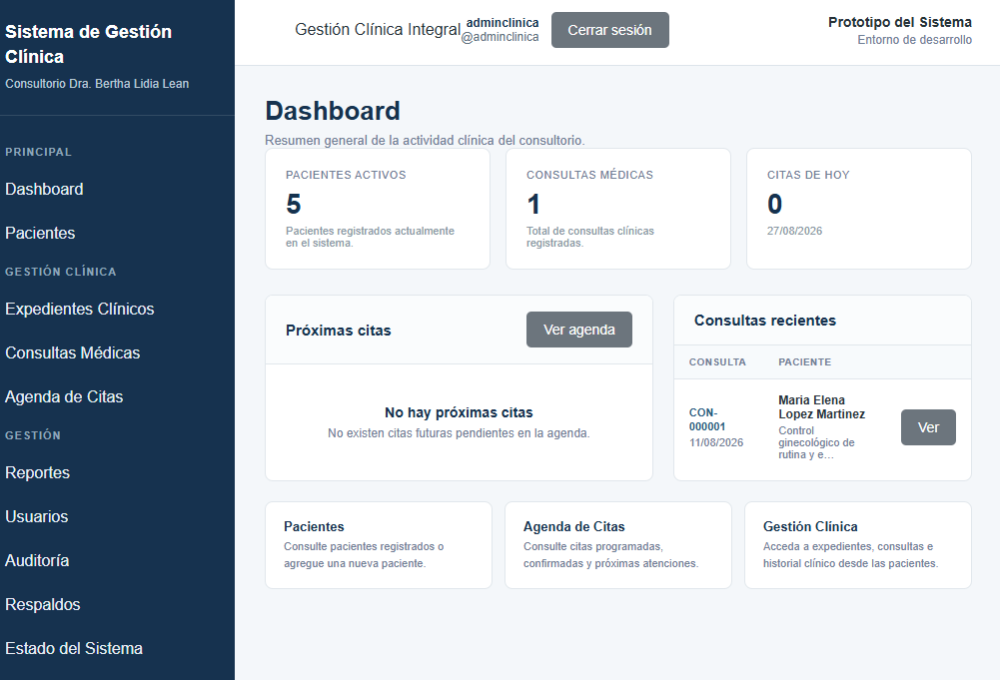
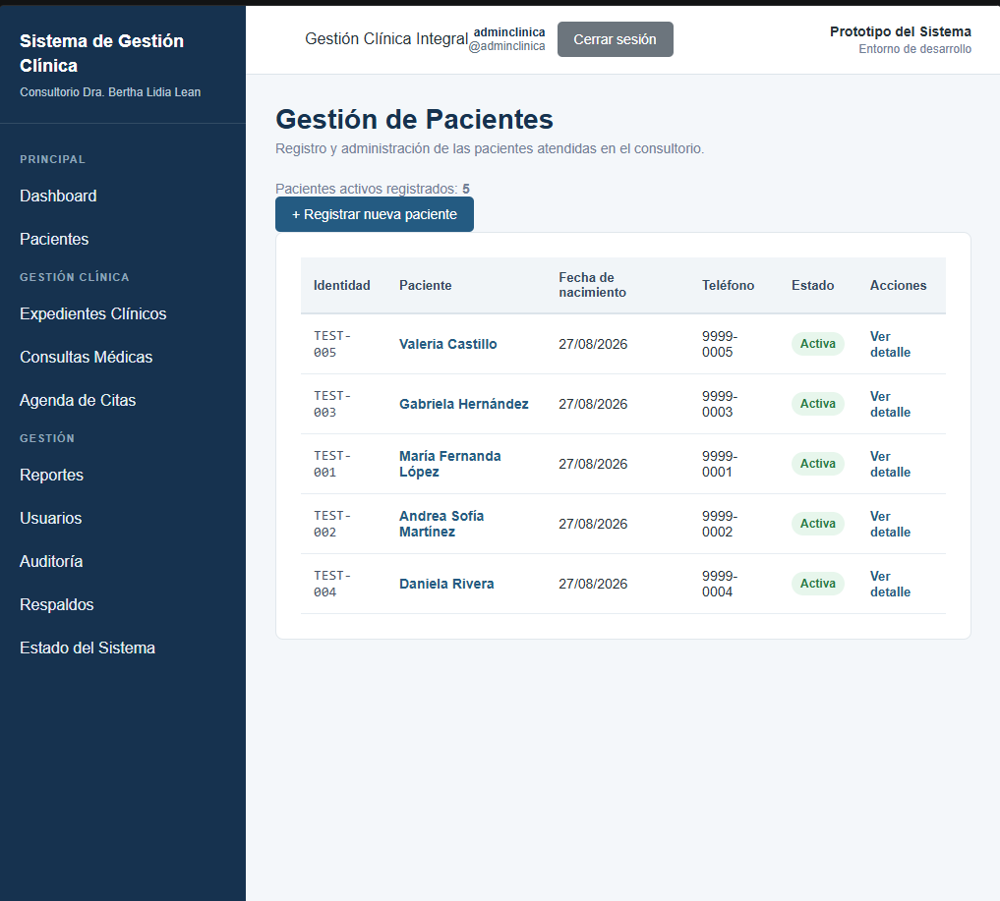
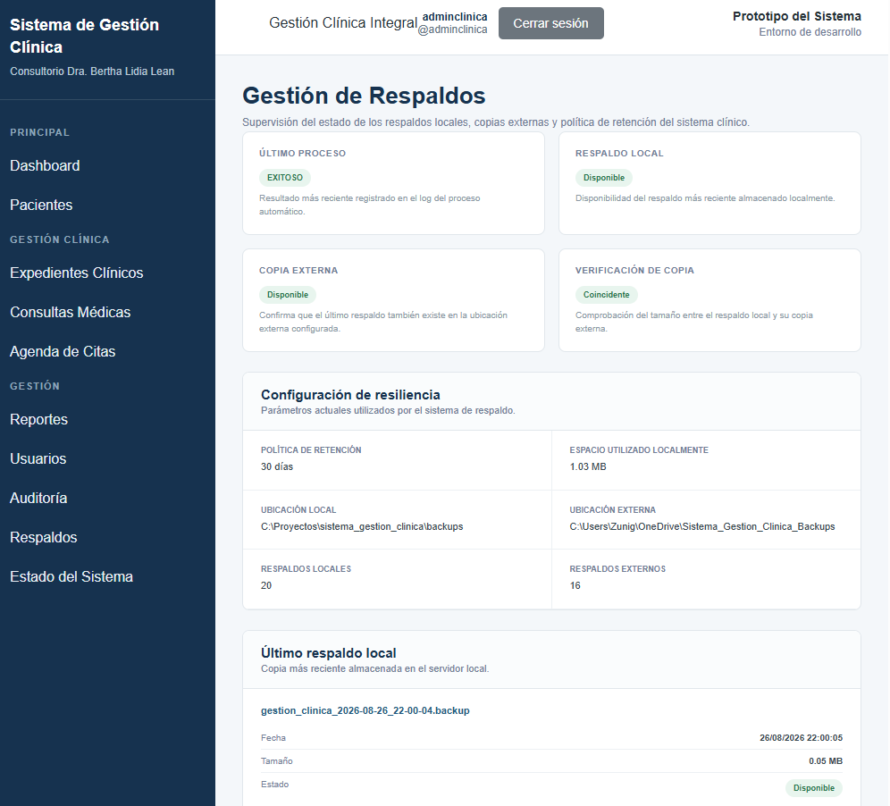

# Clinical Management System


A web-based clinical management system developed with Django and PostgreSQL to support the digital management of patients, medical records, consultations, appointments, users, auditing, monitoring, reports, and database backups.


The project was designed to modernize a clinical workflow that previously depended on paper records and a legacy local application, with emphasis on data integrity, access control, backup management, and operational continuity.


---


## Problem Solved


The original clinical workflow relied heavily on physical records and a locally installed legacy application, creating several operational risks:


- Dependence on a single local computer

- Limited data protection and recovery capabilities

- Manual processes for patient and clinical information

- Lack of centralized auditing

- Limited control over user access

- Risk of data loss due to hardware failure or human error


This project provides a modern web-based architecture designed to centralize clinical information and improve reliability, maintainability, security, and data recovery capabilities.


---


## Features


- Patient registration and management

- Clinical record management

- Medical consultation tracking

- Appointment scheduling

- User authentication

- Role-based access control

- Audit logging

- System monitoring

- Clinical and administrative reports

- PostgreSQL database integration

- Database backup creation

- Backup restoration tools

- Automatic backup management

- External backup copy support


---


## Screenshots

### Dashboard
Overview of key clinical activity, including active patients, recent consultations, and appointment status.



### Patient Management
Interface for registering, viewing, and managing patient records within the system.



### Backup Management
Module for monitoring backup status, retention settings, local and external copies, and recovery support.




---


## Tech Stack


- **Backend:** Python, Django 6.1

- **Database:** PostgreSQL

- **Frontend:** HTML, CSS, Django Templates

- **Database Driver:** psycopg

- **Environment Management:** python-dotenv

- **Version Control:** Git and GitHub


---


## Project Structure


```text

clinical-management-system/

├── auditoria/       # Audit logging

├── citas/           # Appointment scheduling

├── config/          # Django project configuration

├── consultas/       # Medical consultations

├── dashboard/       # Main dashboard

├── expedientes/     # Clinical records

├── monitoreo/       # System monitoring

├── pacientes/       # Patient management

├── reportes/        # Reports

├── respaldos/       # Backup and restoration tools

├── templates/       # Shared templates

├── usuarios/        # Authentication and user management

├── manage.py

├── requirements.txt

├── .env.example

└── .gitignore

```


---


## Installation


### 1. Clone the repository


```bash

git clone https://github.com/dzun93/clinical-management-system.git

cd clinical-management-system

```


### 2. Create a virtual environment


```bash

python -m venv venv

```


### 3. Activate the virtual environment


On Windows:


```bash

venv\Scripts\activate

```


On Linux/macOS:


```bash

source venv/bin/activate

```


### 4. Install dependencies


```bash

pip install -r requirements.txt

```


### 5. Configure environment variables


Create a `.env` file in the project root based on `.env.example`.


Example:


```env

DJANGO_SECRET_KEY=your-secret-key

DB_PASSWORD=your-postgresql-password

```


Do not commit the `.env` file to version control.


### 6. Create the PostgreSQL database


Create a PostgreSQL database named:


```text

gestion_clinica

```


The current development configuration expects:


```text

Database: gestion_clinica

User: postgres

Host: localhost

Port: 5432

```


The PostgreSQL password is provided through the `DB_PASSWORD` environment variable.


### 7. Apply database migrations


```bash

python manage.py migrate

```


### 8. Create an administrator account


```bash

python manage.py createsuperuser

```


### 9. Run the development server


```bash

python manage.py runserver

```


The application will normally be available at:


```text

http://127.0.0.1:8000/

```


---


## Backup and Recovery


The project includes custom Django management commands for database backup and recovery operations.


Available commands include:


```bash

python manage.py crear_respaldo

python manage.py restaurar_respaldo

python manage.py verificar_restauracion

python manage.py limpiar_respaldos

python manage.py copiar_respaldo_externo

python manage.py ejecutar_respaldo_automatico

```


These tools are intended to improve data resilience and provide mechanisms for recovering the PostgreSQL database in case of failure.


Backup files themselves are excluded from the Git repository.


---


## Security


Sensitive configuration values are managed through environment variables rather than being stored directly in the source code.


The repository excludes:


- `.env` files

- Database files

- Application logs

- Generated backups

- Virtual environments

- IDE-specific files


An `.env.example` file is included to document the required environment variables without exposing credentials.


---


## Development Status


This project is under active development.


Current development areas include:


- Improving user experience and navigation

- Expanding system monitoring

- Strengthening backup and recovery workflows

- Improving reporting capabilities

- Adding automated tests

- Preparing the application for production deployment


---


## Future Improvements


Planned improvements include:


- REST API integration

- Expanded automated testing

- Docker containerization

- Production deployment

- Improved access-control policies

- Enhanced audit reporting

- Automated backup scheduling

- Improved disaster recovery procedures

- UI and accessibility improvements


---


## Project Background


This system was developed as a software engineering project focused on modernizing the information-management processes of a medical practice.


The project combines software development, database management, security controls, auditing, backup strategies, and operational resilience.


It is also maintained as part of my professional software engineering portfolio.


---


## Author


**Dennis Zuniga**


Computer Technology Engineering  

Python · Django · PostgreSQL · SQL · Git


GitHub: [dzun93](https://github.com/dzun93)


---


## Disclaimer


This repository is intended for educational, portfolio, and software engineering demonstration purposes.


Any data used for development or demonstration should be fictional or anonymized. Real patient information, credentials, database backups, or other confidential information must never be committed to this repository.


